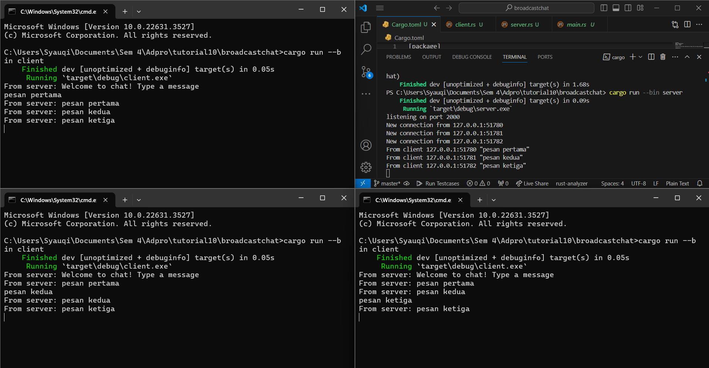
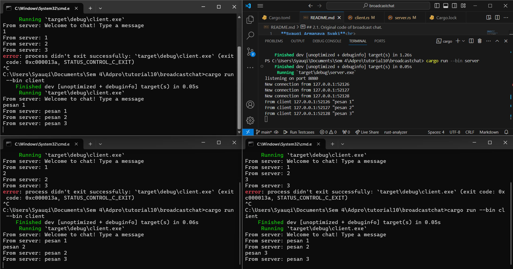

**Syauqi Armanaya Syaki** 
**2206829010** 
**Pemrograman Lanjut C** 

## 2.1. Original code of broadcast chat.

Berdasarkan hasil eksekusi diatas, dilakukan pengiriman pesan dari 3 client yang berbeda, lalu server menerima pesan tersebut dan mengirimkannya ke semua client termasuk yang mengirim pesan itu. Untuk melakukannya dapat dengan membuka 4 terminal, 1 untuk menjalankan server dengan command `cargo run --bin server` dan 3 untuk menjalankan client dengan command `cargo run --bin client`.

## 2.2. Modifying the websocket port

Setelah dilakukan penggantian terhadap port di kedua file menjadi 8080, di mana pada `client.rs` penggantian port ada pada Uri `ClientBuilder` yang merupakan builder koneksi WebSocket pada client dan pada `server.rs` penggantian port ada pada `listener` yang berfungsi sebagaii TCP listener koneksi, lalu pada perintah print untuk menunjukkan bahwa port sudah berubah. Setelah dilakukan perubahan ini, program masih berjalan dengan normal.